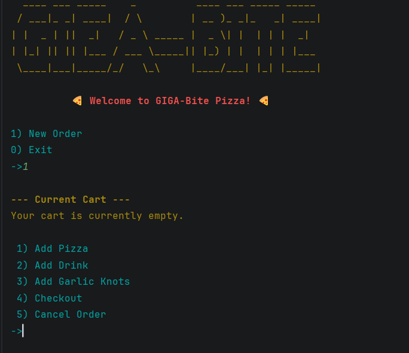
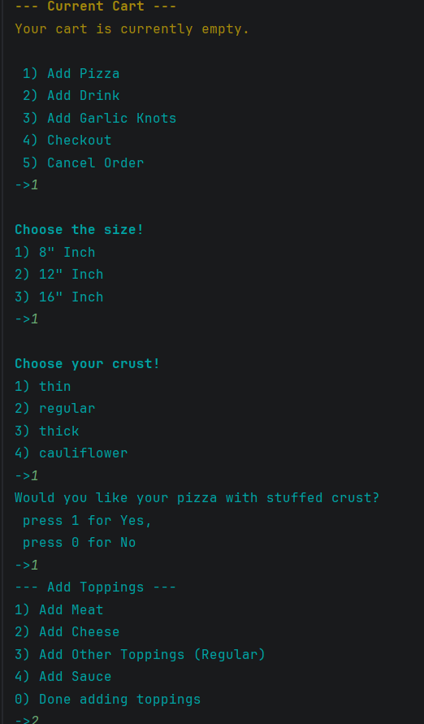
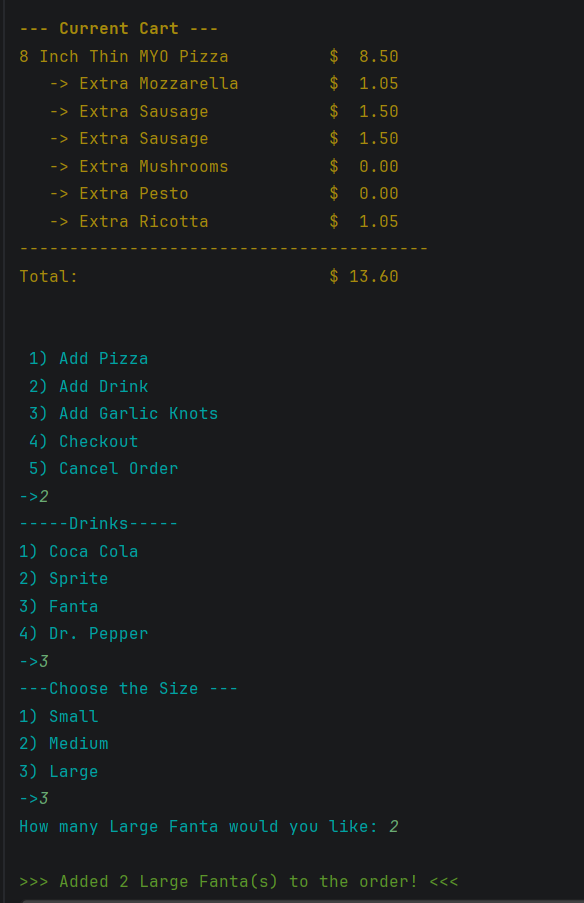
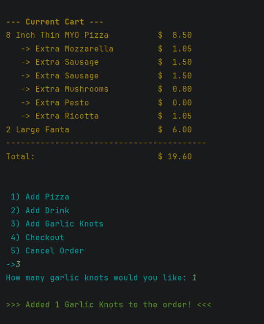
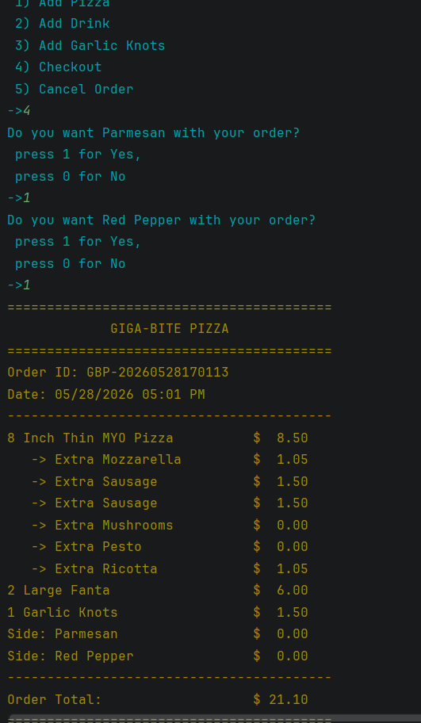
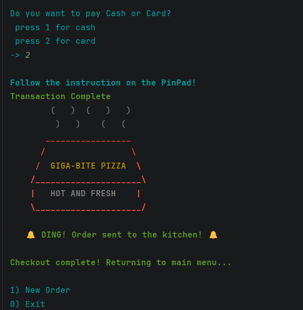
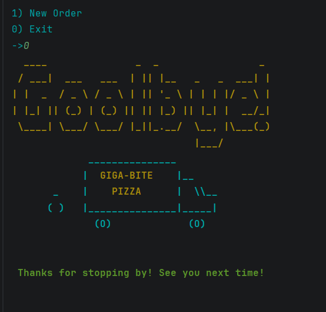
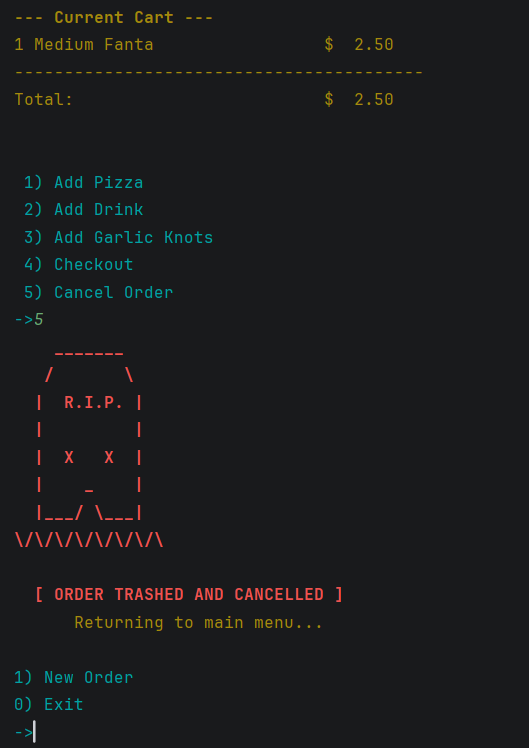
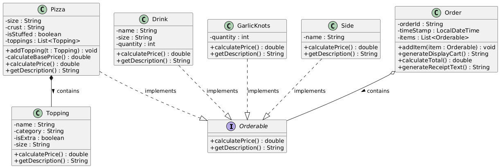

# GIGA-Bite Pizza POS System

A robust, enterprise-grade Point-of-Sale (POS) backend application built in Java. This console-based system allows users to seamlessly build custom pizza orders, manage dynamically priced toppings, add sides and drinks, process cash/card payments, and generate formatted text-file receipts.

This project was developed as a comprehensive capstone for the Application Development track at Year Up United, focusing heavily on Object-Oriented Programming (OOP), modular architecture, clean code practices, and a custom ANSI-colorized user interface.

---

## 📑 Table of Contents
1. [Features](#-features)
2. [Application Preview](#-application-preview)
3. [System Architecture & Package Structure](#-system-architecture--package-structure)
4. [Folder Structure](#-folder-structure)
5. [Class Diagram](#-class-diagram)
6. [Technologies Used](#-technologies--concepts-used)
7. [How to Run](#-how-to-run)

---

## 🚀 Features

* **Custom ANSI UI Engine:** Features a fully colorized terminal interface with dynamic cart updates, error state highlighting, and custom ASCII graphics (including startups, checkouts, and order cancellations) managed via a dedicated `Graphics` utility.
* **Dynamic Pricing Engine:** Calculates complex pricing matrices using Java `switch` expressions, adjusting topping costs based on pizza size, category (meat vs. cheese), and standard/extra portions.
* **Interactive Console Validation:** A fully validated, loop-driven command-line interface that strictly prevents bad user input (like strings instead of numbers) and guides the customer through a step-by-step ordering process.
* **Automated Receipt Generation:** Utilizes Java File I/O and `LocalDateTime` formatting to automatically generate and save detailed order receipts to a dedicated `data/receipts/` directory.
* **Checkout & Payment Logic:** Includes a payment processing loop that calculates running subtotals, remaining balances, and exact change due before finalizing an order.

---

## 📸 Application Preview

| Welcome & Main Menu | Pizza Configuration |                        Drinks Menu                         |
| :---: | :---: |:----------------------------------------------------------:|
|  |  |  |

|                    Garlic Knots Menu                     |                      Checkout Process                       |                    Payment Process                    |
|:--------------------------------------------------------:|:-----------------------------------------------------------:|:-----------------------------------------------------:|
|  |  |  |

| System Exit Graphic | Order Cancellation Graphic |
| :---: | :---: |
|  |  |

---

## 🏗️ System Architecture & Package Structure

The application strictly enforces separation of concerns, dividing the user interface, business logic, and data management into dedicated packages.

* **`com.pluralsight.entities` (Domain Layer):** * Contains the core business objects (`Pizza`, `Topping`, `Drink`, `GarlicKnots`, `Side`).
  * Implements a strict "has-a" **Composition** relationship where `Pizza` objects control the lifecycle of their `Topping` objects.
  * Utilizes the `Orderable` interface to allow the main `Order` class to aggregate diverse items seamlessly for receipt generation and total calculation.
* **`com.pluralsight.ui` (Presentation Layer):**
  * Contains the `UserInterface`, `Console`, `Graphics`, and `ColorUtils` classes. Handles all user prompts, ASCII rendering, input validation boundaries, and menu control flow loops.
* **`com.pluralsight.dataManager` (Persistence Layer):**
  * Contains the `ReceiptFileManager`, a dedicated utility class handling all hard-drive write operations safely using `try-with-resources` to prevent memory leaks.

---

## 📂 Folder Structure

```text
giga-bite-pizza/
├── data/
│   └── receipts/               # Auto-generated .txt receipts are saved here
├── images/                     # Application screenshots and UML diagrams
│   ├── diagram.png
│   ├── ss1.png
│   ├── ss2.png
│   ├── ss3.png
│   ├── ss4.png
│   ├── ss5.png
│   ├── ss6.png
│   ├── ss7.png
│   └── ss8.png
└── src/
    └── main/
        └── java/
            └── com.pluralsight/
                ├── dataManager/
                │   └── ReceiptFileManager.java
                ├── entities/
                │   ├── Drink.java
                │   ├── GarlicKnots.java
                │   ├── Order.java
                │   ├── Orderable.java
                │   ├── Pizza.java
                │   ├── Side.java
                │   └── Topping.java
                ├── ui/
                │   ├── ColorUtils.java
                │   ├── Console.java
                │   ├── Graphics.java
                │   └── UserInterface.java
                └── Main.java
```

---

## 📊 Class Diagram



---

## 💻 Technologies & Concepts Used

* **Language:** Java
* **Core Concepts:** * Object-Oriented Programming (OOP)
  * Interfaces & Contracts (`Orderable`)
  * Composition vs. Aggregation
  * ANSI Escape Codes & Java Text Blocks (`"""`)
  * File Input/Output (I/O) & Directory Management
  * Encapsulation & Single Responsibility Principle (SRP)

---

## ⚙️ How to Run

1. Clone the repository to your local machine.
2. Open the project in IntelliJ IDEA (or your preferred Java IDE).
3. Run the `Main.java` class located in `src/main/java/com.pluralsight/Main.java`.
4. Follow the on-screen prompts to build your order!
5. Upon successful checkout, view your generated receipt in the `data/receipts/` directory.